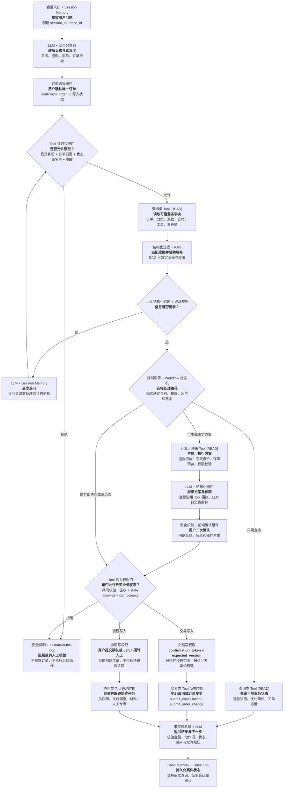

# Agent 整体流程链路｜简化框线稿 v0.3

> 目标：让面试官先看懂 Agent 如何从用户问题走到真实业务结果。此稿只确认信息结构，不代表最终视觉。



## 一眼读懂的四层结构

1. **理解**：识别诉求、原因和紧急度。
2. **核实**：确认订单，读取订单级真实事实。
3. **决策**：判断信息完整度，并选择一条处理路径。
4. **闭环**：执行、反馈、告知下一步并保留可追踪状态。

## Tool 的四类设计

| Tool 类型 | 能做什么 | 典型 Tool | 权限要求 |
| --- | --- | --- | --- |
| 查询类 `[READ]` | 读取订单级事实，不改变业务状态 | `get_order_detail`、`get_policy_snapshot`、`get_refund_status`、`get_payment_events` | 登录身份、订单归属、Workflow 状态白名单、字段脱敏 |
| 计算／决策类 `[READ]` | 根据结构化事实确定性计算方案 | `calculate_refund_quote`、`get_change_quote`、`get_guarantee_quote`、`validate_action_permission` | 订单已确认、事实完整、政策与订单版本一致 |
| 交易类 `[WRITE]` | 改变订单或退款相关业务状态 | `submit_cancellation`、`submit_order_change`、`accept_supplier_offer` | 用户二次确认、`confirmation_token`、`expected_version`、风险在授权范围、`idempotency_key` |
| 协同类 `[WRITE]` | 创建供应商、支付、材料或人工协作任务 | `create_supplier_case`、`create_payment_investigation`、`create_human_handoff` | Workflow 状态允许、必要的用户提交确认，或 L3/L4 硬转人工、`idempotency_key` |

33 个 Tool 的完整机器可读契约位于 `contracts/tool-contracts.json`。

## Tool 权限的七道检查

```text
1. authenticated_user_id：当前用户已登录
2. confirmed_order_id：订单由用户显式确认
3. order ownership：用户有权查看或操作该订单
4. allowed_conversation_states：当前 Workflow 状态允许调用
5. risk_level：风险没有超过该 Tool 的授权范围
6. confirmation_token + expected_version：写操作对象、金额和版本未变化
7. idempotency_key：重复点击不会产生第二次业务操作
```

任一检查失败，Tool 返回结构化错误码；LLM 不能绕过权限门，也不能把失败改写成成功。

## 图中各技术角色的边界

- **LLM**：理解用户表达、生成结构化意图、提出最少追问、解释业务结果；不自行计算退款金额，也不直接决定权限。
- **Tool Access Gateway**：在 Tool 执行前统一检查身份、订单范围、Workflow 状态、风险、确认 token、版本和幂等键。
- **Tool**：查询订单、政策、退款与支付事实；确定性计算报价；执行取消、变更或创建协作任务。
- **RAG**：召回政策说明、客服知识与话术依据，仅辅助解释；订单最终适用政策以成交政策快照和规则结果为准。
- **规则引擎／状态机**：计算金额、检查条件、确定可执行路径和状态迁移，是业务决策的确定性底座。
- **Memory**：Session Memory 保存当前对话上下文；Case Memory 保存跨会话案件状态；Trace Log 用于审计和问题回放。
- **安全机制**：身份与订单权限校验、敏感信息保护、二次确认、幂等、输出事实校验和高风险转人工。
- **Human-in-the-loop**：处理供应商例外、到店无房、高金额或低置信度等不适合自动决策的场景。

## 最终图建议保留的三条 Tool 路径

- **只读查询**：读取状态 → 事实校验 → 回复用户。
- **确定性交易**：计算方案 → 用户确认 → 写权限校验 → 执行 Tool。
- **外部协同／高风险**：风险路由 → 创建工单或人工移交 → 显示等待方与 SLA。
