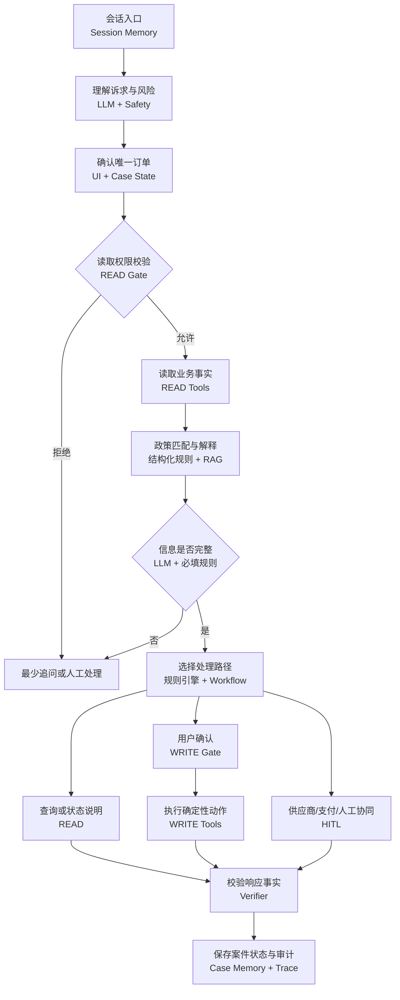

# Agent 工作流与技术方案

## 设计结论

采用“单 Agent 编排 + 显式状态机 + 规则引擎 + Tool 权限网关”，而不是完全自主的 ReAct 循环。LLM 擅长理解和表达，但金额、政策、业务状态与操作授权必须由确定性组件决定。

## 技术角色边界

| 组件 | 负责 | 不负责 |
| --- | --- | --- |
| LLM | 意图、原因、紧急度、信息抽取和面向用户的自然语言表达 | 计算金额、决定权限、伪造业务状态 |
| 规则引擎 | 政策时点、金额、风险、SLA 和路径选择 | 与用户自由对话 |
| Tool | 读取可信事实或执行确定性动作 | 绕过身份、确认和状态校验 |
| RAG | 在结构化政策命中后辅助解释 | 决定金额与权限 |
| Session Memory | 保存当前会话与订单确认状态 | 代替业务事实或长期保存敏感材料 |
| Case Memory | 保存跨会话案件事件和外部协同状态 | 改写历史事件 |
| Trace / Verifier | 校验输出、记录工具回执并支持质检回放 | 向 C 端展示模型隐性推理 |

## Tool 设计

仓库实现 33 个 Tool：20 个 READ、13 个 WRITE。完整字段、允许状态和拒绝条件见 [`contracts/tool-contracts.json`](../contracts/tool-contracts.json)。

| 类别 | 典型 Tool | 作用 |
| --- | --- | --- |
| 订单与政策 | `get_order_detail`、`get_policy_snapshot` | 锁定订单事实和成交时政策 |
| 报价与状态 | `calculate_refund_quote`、`get_refund_status`、`get_payment_events` | 返回确定性金额和资金状态 |
| 取消与变更 | `submit_cancellation`、`get_change_quote`、`submit_order_change` | 在确认后执行低风险动作 |
| 外部协同 | `create_supplier_case`、`create_payment_investigation` | 将等待对象、SLA 和结果写入案件 |
| 履约恢复 | `verify_fulfillment_issue`、`get_alternative_hotels` | 优先恢复住宿并控制额外费用 |
| 风险与人工 | `validate_action_permission`、`create_human_handoff` | 阻断越权操作并携带上下文升级 |

## 权限门

每次读取至少校验：

1. 登录身份有效；
2. 用户已显式确认目标订单；
3. 订单属于当前用户；
4. 当前 Workflow 状态允许该 Tool；
5. 返回字段经过白名单与脱敏。

每次写入还必须校验：

6. 风险等级、金额和动作在 Agent 授权边界内；
7. 用户确认令牌、订单版本和幂等键有效。

Tool 返回未知或超时时，Workflow 先通过查询 Tool 核对结果，不能直接重试资金或订单写操作。

## 记忆与安全

- Session Memory 只保存完成当前对话所需的最小状态；
- Case Memory 使用追加式事件保存业务过程，支持跨会话恢复；
- 成交政策快照、订单状态和 Tool 回执优先级高于聊天记忆；
- 原始证件、银行卡、验证码和敏感证明不进入 LLM 上下文；
- C 端只看到结论、方案与进度，Trace 仅存在于独立演示/运营层。

## 可执行证据

- [`backend/app/workflow.py`](../backend/app/workflow.py)：A–L 显式 Workflow；
- [`backend/app/rules.py`](../backend/app/rules.py)：退款、风险、支付语义和路径规则；
- [`backend/app/tools.py`](../backend/app/tools.py)：Tool Registry、权限、事务和审计；
- [`contracts/`](../contracts/)：Tool、Agent 响应和案件事件契约；
- [`backend/tests/`](../backend/tests/)：权限、规则、数据库、接口与 Workflow 自动化测试。
